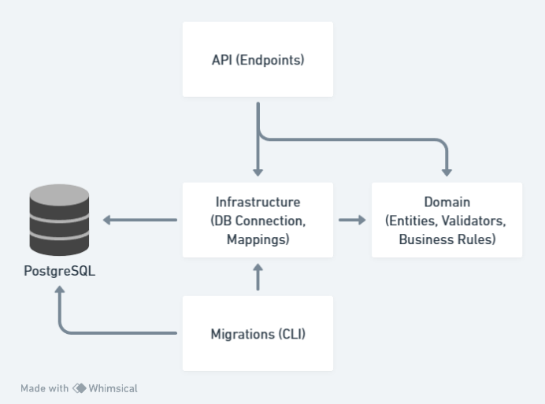

# TransferHub API

<p align="center">
  
</p>

TransferHub is an HTTP API that exposes endpoints for participant registration, individual account deposits, statements, and transfers between participants. My intention with TransferHub is to showcase a production-level project on GitHub, utilizing the tools with which I have the most experience.

Feel free to leave suggestions or to make a contribution.

## Tech stack

The project is using .NET 8 with Minimal APIs and PostgreSQL for the database. It has unit and integration tests using NUnit and uses some common libraries from the .NET ecosystem like Entity Framework, Fluent Validation, Fluent Assertions and Bogus.

For the integration tests, it uses the built-in `WebApplicationFactory` from .NET and uses [TestContainers](https://testcontainers.com/) to spin a PostgreSQL Docker container.

As for database migrations, I've opted to create a separate project that acts as a Command Line tool, facilitating the process of running migrations on a pipeline. The project is using Fluent Migrator to describe and execute the migrations. 

## Architecture



This diagram shows all the dependencies and how they interact, I decided to isolate my Domain layer to promote maintainability and testability. As for database interactions, only the infrastructure and the migrations project can create connections. 

## Endpoints

### Participants

#### Create Participant

Create a new participant. 

```http
  POST /api/v1/participants
```

#### Statement

Gets a statement with transactions from a participant.

```http
  GET /api/v1/participants/{id}/statement?page=1&pageSize=20
```

### Transactions

#### Credit 

Create a new deposit for a participant.

```http
  POST /api/v1/transactions/credit
```

#### Transfer

Transfer money from one participant to another.

```http
  POST /api/v1/transactions/transfer
```

## Next Steps

- Add Kubernetes support
- Load testing with K6

## License

[MIT License](https://lucasrufo.mit-license.org/) © Lucas Rufo
